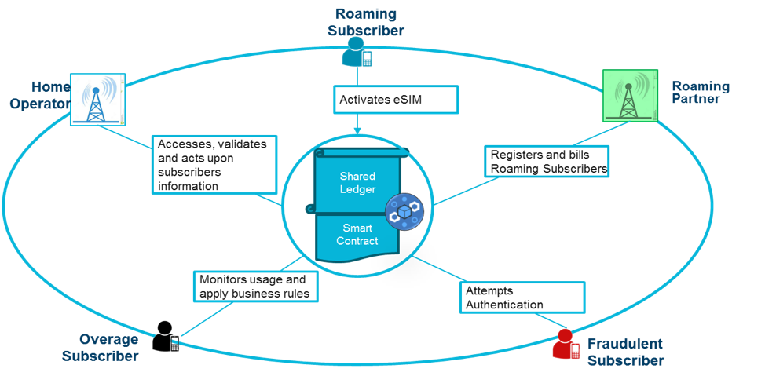
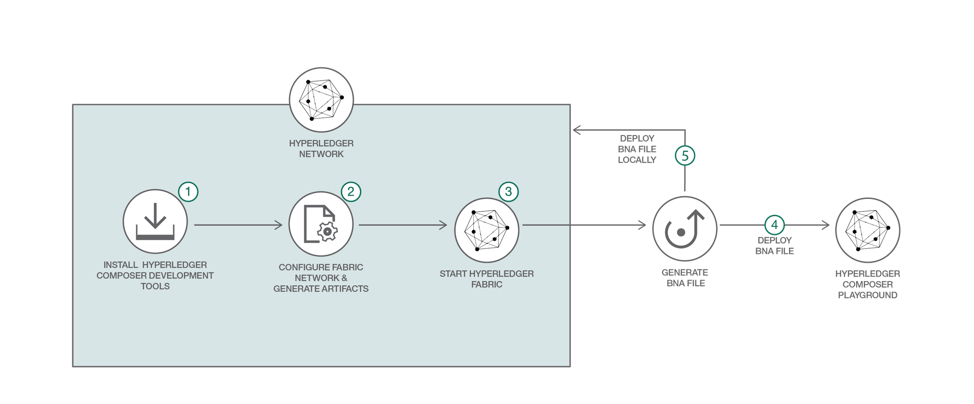

# BlockchainforTelecomRoaming

This is a proof of concept to demonstrate how Blockchain brings the CSPs on single Blockchain Hyperledger network which enables direct exchange of information with transactions that are immutable and executed based on consensus model using smart contract rules. 

This business network defines:

**Participants:**
`Home Operator` `Roaming Partner` 

**Assets:**
`Subscriber Sims`

**Transactions:**
`discovery` `authentication` `updaterate` `callout` `overagecheck` `callend` `callpay` `addUser`



There are four scenarions covered :

1. Roaming Subscriber Identification
       A subscriber moves to a new location out of home network. Is disvovered by `Roaming Partner`. `discovery` trasaction is executed.
       `Roaming Partner` authenticates Roaming Subscriber as a visitor from Home Operator. `authentication` transaction is executed.
       `Home Operator` register Roaming Subscriber accordingly. `updaterate` transaction is executed.
2. Roaming Subscriber Billing
     Now that authorized, Roaming Subscriber uses Roaming Partner network to initiate a call. `callout` and `callend` trasactions are executed.
     The charges for network usage are instantaneously recorded between Home Operator and Roaming Partner based on their agreement. `callpay` trasaction is executed.
3. Fraud Identification
    Addition of a Fraudulent Subscriber is simulated. `addUser` transaction is executed.
    Fraudulent Subscriber tries to registed to access the Home Operator network using the same MSISDN of an existing user
    Authentication step identifies the subscriber and prevent the fraud. `authentication` transaction is executed.
4. Overage Management
    A roaming subscriber intiates a call/
    Smart contract recognizes that subscriber is potentially reaching overage threshold. `callout` trasaction is executed.
    Operator notifies the Overage Subscriber of the potential tariff change.`overagecheck` trasaction is executed.


Audience level : Intermediate Developers

If you have an IBM cloud lite account, you can also use the Starter Plan for 30 days to do this pattern.

## Included Components
* Hyperledger Fabric
* Hyperledger Composer

## Included technologies
* Blockchain
* Containers
* Cloud

## Application Workflow Diagram


* Install Hyperledger Composer development tools
* Configure and start Hyperledger Fabric network
* Generate the Business Network Archive file
* Deploy the Business Network Archive using Composer Playground
* (Alternative method) Deploy the Business Network Archive on Hyperledger Composer running locally


## Steps
1. [Generate the Business Network Archive (BNA)](#1-generate-the-business-network-archive-bna)
2. [Deploy the Business Network Archive using Composer Playground](#2-deploy-the-business-network-archive-using-composer-playground)
3. [Deploy the Business Network Archive on Hyperledger Composer running locally](#3-deploy-the-business-network-archive-on-hyperledger-composer-running-locally)


## 1. Generate the Business Network Archive (BNA)

To check that the structure of the files is valid, you can now generate a Business Network Archive (BNA) file for your business network definition. The BNA file is the deployable unit -- a file that can be deployed to the Composer runtime for execution.

Use the following command to generate the network archive:
```bash
npm install
```
You should see the following output:
```bash
Creating Business Network Archive

Looking for package.json of Business Network Definition
	Input directory: /Users/<user-name>/Documents/git-demo/roaming

Found:
	Description: Telecom Roaming Demo
	Name: my-network
	Identifier: my-network@0.0.1

Written Business Network Definition Archive file to
	Output file: ./dist/my-network.bna

Command succeeded
```
The `composer archive create` command has created a file called `my-network.bna` in the `dist` folder.

You can test the business network definition against the embedded runtime that stores the state of 'the blockchain' in-memory in a Node.js process.
From your project working directory, open the file test/foodTest.js and run the following command:
```
npm test
```
You should see the following output :
```
> my-network@0.0.1 test /Users/<user-name>/Documents/demo/roaming
> mocha --recursive

  #composer.food.supply
    ✓ Transfer ProductListing to Importer (67ms)
    ✓ Exempt Check for ProductListing (98ms)
    ✓ Transfer ProductListing to Retailer (95ms)

  3 passing (2s)
```

## 2. Deploy the Business Network Archive using Composer Playground
Open [Composer Playground](http://composer-playground.mybluemix.net/), by default the Basic Sample Network is imported.
If you have previously used Playground, be sure to clear your browser local storage by running `localStorage.clear()` in your browser Console.

Now import the `food-supply.bna` file and click on deploy button.
<p align="center">
  
</p>

>You can also setup [Composer Playground locally](https://hyperledger.github.io/composer/installing/using-playground-locally.html).

You will see the following:
<p align="center">
  
</p>

To test your Business Network Definition, first click on the **Test** tab:

Create CSPs using transaction 'resetCSP'

```
Model:
resetCSP {
$class (string, optional): The class identifier for this type ,
noneed (string),
transactionId (string, optional): The instance identifier for this type ,
timestamp (string, optional)
}

Example Value:
{
  "$class": "org.gsc.roaming.resetCSP",
  "noneed": "string",
  "transactionId": "string",
  "timestamp": "2017-10-05T07:24:24.743Z"
}

```

Create Subscribers using transaction 'resetMSISDN '
```
Model:
resetMSISDN {
$class (string, optional): The class identifier for this type ,
noneed (string),
transactionId (string, optional): The instance identifier for this type ,
timestamp (string, optional)
}

Example Value:
{
  "$class": "org.gsc.roaming.resetMSISDN",
  "noneed": "string",
  "transactionId": "string",
  "timestamp": "2017-10-05T07:24:24.749Z"
}

```

Scenario 1 : 

execute transaction 'discovery ' 
{
  "$class": "org.gsc.roaming.discovery",
  "asset": "string",
  "rp": "string",
  "location": "string",
  "lat": "string",
  "long": "string",
  "transtype": "string",
  "transactionId": "string",
  "timestamp": "2017-10-05T07:24:24.724Z"
}


execute transaction 'authentication ' 
{
  "$class": "org.gsc.roaming.authentication",
  "asset": "string",
  "rp": "string",
  "transtype": "string",
  "roaming": "string",
  "flag": "string",
  "transactionId": "string",
  "timestamp": "2017-10-05T07:24:24.657Z"
}

execute transaction 'updaterate' 
{
  "$class": "org.gsc.roaming.updaterate",
  "asset": "string",
  "rp": "string",
  "ratetype": "string",
  "transtype": "string",
  "transactionId": "string",
  "timestamp": "2017-10-05T07:24:24.811Z"
}

Similar for other three scenarios.


## 3. Deploy the Business Network Archive on Hyperledger Composer running locally

Please start the local Fabric using the [instructions](https://github.com/IBM/BlockchainNetwork-CompositeJourney#2-starting-hyperledger-fabric).
Now change directory to the `dist` folder containing `my-network.bna` file and type:
```
cd dist
composer runtime install --card PeerAdmin@hlfv1 --businessNetworkName my-network
composer network start --card PeerAdmin@hlfv1 --networkAdmin admin --networkAdminEnrollSecret adminpw --archiveFile food-supply.bna --file networkadmin.card
composer card import --file networkadmin.card
```

You can verify that the network has been deployed by typing:
```
composer network ping --card admin@my-network
```

You should see the the output as follows:
```
The connection to the network was successfully tested: events
	version: 0.18.1
	participant: org.hyperledger.composer.system.NetworkAdmin#admin
	identity: org.hyperledger.composer.system.Identity#1f95efceac5421ad34d73130c8f16fbc2d29b7dce0c3425afb3b5f077242b1fc

Command succeeded
```

To create the REST API we need to launch the `composer-rest-server` and tell it how to connect to our deployed business network.
Now launch the server by changing directory to the `roaming` folder and type:
```bash
cd ..
composer-rest-server
```

Answer the questions posed at startup. These allow the composer-rest-server to connect to Hyperledger Fabric and configure how the REST API is generated.
* Enter `admin@my-network` as the card name.
* Select `never use namespaces` when asked whether to use namespaces in the generated API.
* Select `No` when asked whether to secure the generated API.
* Select `Yes` when asked whether to enable event publication.
* Select `No` when asked whether to enable TLS security.

**Test REST API**

If the composer-rest-server started successfully you should see these two lines are output:
```
Web server listening at: http://localhost:3000
Browse your REST API at http://localhost:3000/explorer
```

Open a web browser and navigate to http://localhost:3000/explorer

You should see the LoopBack API Explorer, allowing you to inspect and test the generated REST API. Follow the instructions to test Business Network Definition as mentioned above in the composer section.


## Additional Resources
* [Hyperledger Fabric Docs](http://hyperledger-fabric.readthedocs.io/en/latest/)
* [Hyperledger Composer Docs](https://hyperledger.github.io/composer/introduction/introduction.html)


## License
[Apache 2.0](LICENSE)